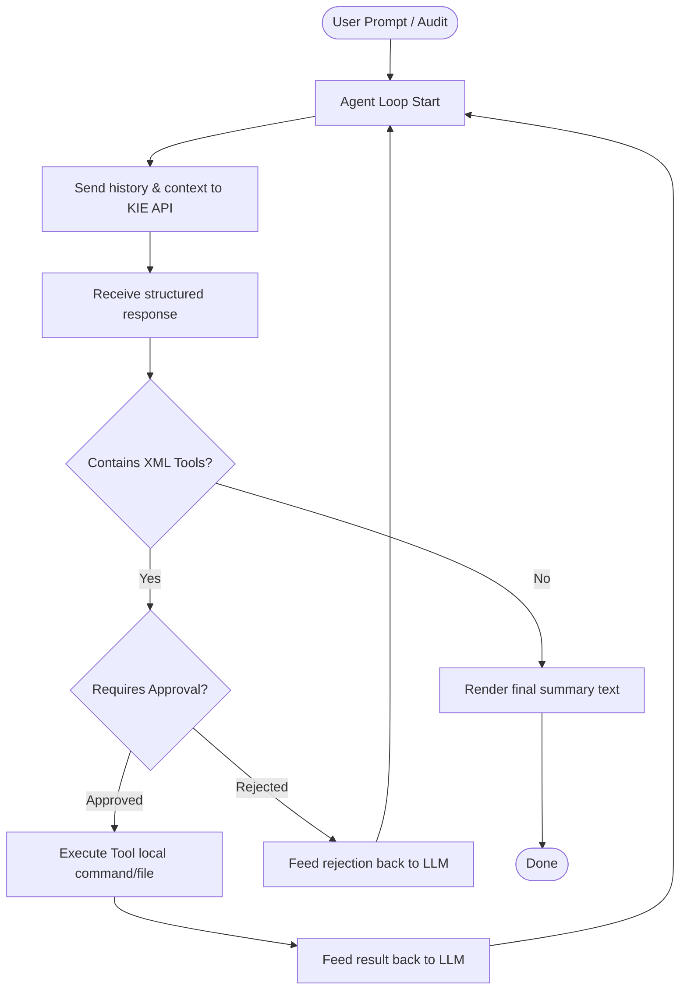

<p align="center">
  <a href="https://kie.ai?ref=69126d09c7c87c2774b3f82280350c4c">
    
  </a>
</p>

# Zelos

> **Zelos** is an autonomous AI coding agent extension for Visual Studio Code using the [KIE API](https://kie.ai?ref=69126d09c7c87c2774b3f82280350c4c).

Zelos operates in an autonomous loop inside your workspace, utilizing advanced capabilities to analyze files, run tests, critique code, and automatically refactor or implement features based on your instructions.

### 💰 Extremely Cost-Effective Agentic Loops
Running autonomous AI agents typically consumes a massive amount of tokens due to continuous reasoning, context injection, and iterative tool steps. Zelos is built exclusively for the [KIE API](https://kie.ai?ref=69126d09c7c87c2774b3f82280350c4c), which provides high-performance models at prices **30% to 80% cheaper** than official APIs. This makes running complex autonomous agent loops highly affordable and accessible for everyday development.

---

## ✨ Features

- **🤖 Autonomous Agent Loop**: Zelos executes multiple actions sequentially, reasoning through terminal outputs and file changes step-by-step until the task is complete.
- **🛠️ Rich Workspace Integration**: The agent can perform real-world actions directly in VS Code through approval-guarded XML-based tools:
  - `<create_file>`: Create or modify files in the workspace.
  - `<read_file>`: Read file content for analysis.
  - `<list_files>`: List project structures.
  - `<run_command>`: Execute terminal commands (compiling, testing, formatting).
  - `<visual_review>`: Ask a separate visual model to review page UI, click buttons, type inputs, scroll, and verify functionality on a running Chrome instance.
- **📸 Multimodal Image Upload & Context**:
  - **Chat Image Attachment**: Directly attach images in the Zelos sidebar panel. Images are uploaded to KIE's temporary storage, and their URLs are passed into the model's multimodal context.
  - **Visual Review screenshots**: The navigation review subagent automatically uploads screenshots of the debug Chrome browser using the KIE base64 upload API, facilitating visually guided page analysis.
  - Supports **Gemini 3.5 Flash** with custom endpoints and `inline_data` payloads.
- **🛡️ Secure Approval Workflows**: Choose between:
  - **Prompt mode** (default): Review and approve every terminal command or file modification before it runs.
  - **Auto-approve/Reject**: Full execution automation or high-security lockouts.
- **🔍 Comprehensive Workspace Audit**:
  - **Architecture Reviews**: Checks directories and structures against clean code paradigms.
  - **Automated Code Review**: Flags bugs, anti-patterns, and vulnerabilities.
  - **Cognitive Complexity Audit**: Evaluates functions and methods against a customizable cognitive complexity threshold (e.g., nesting, logical branches) and plans refactorings.
  - **Self-Critique & Auto-Correction**: Autonomously corrects detected flaws or failing tests by modifying the workspace and re-running the test suite.
- **🗜️ Token-Saving Conversation Compaction**:
  - Zelos intelligently compacts verbose tool outputs and older message histories. This drastically reduces the context size for longer conversations, lowering API costs while maintaining reasoning memory.
- **🎨 Premium Chat Webview**: A highly responsive, custom-styled Outfit/Fira Code interface with real-time streaming status updates, interactive tool execution logs, and easy configurations.
- **💰 Real-Time Credit Balance**: Track your KIE API account credit balance directly inside the webview panel top bar with a click-to-refresh badge.

---

## 🚀 Installation & Requirements

### Prerequisites

- VS Code `^1.80.0`
- Node.js & npm (for compiling and executing actions)
- A valid **KIE API Key** from [KIE.ai](https://kie.ai?ref=69126d09c7c87c2774b3f82280350c4c)

### Setup

1. Clone or download the repository into your VS Code extensions or development directory:
   ```bash
   git clone https://github.com/TrackZone1/Zelos.git
   ```
2. Navigate to the folder and install dependencies:
   ```bash
   npm install
   ```
3. Compile the extension:
   ```bash
   npm run compile
   ```
4. Press `F5` in VS Code to launch a new **Extension Development Host** window with Zelos active.

---

## ⚙️ Configuration

Open VS Code settings (`Ctrl+,` or `Cmd+,`) and search for **Zelos** to configure:

| Setting | Type | Default | Description |
|---|---|---|---|
| `zelos.api.key` | `string` | `""` | Your secret API key from KIE. |
| `zelos.api.url` | `string` | `https://api.kie.ai` | Base URL for the KIE API endpoints. |
| `zelos.api.model` | `string` | `gpt-5-5` | The LLM model used (e.g. `gpt-5-5`, `gpt-5-codex`). |
| `zelos.commandApprovalMode`| `enum` | `prompt` | Approval strategy for running terminal commands (`prompt` \| `acceptAll` \| `rejectAll`). |
| `zelos.fileApprovalMode` | `enum` | `prompt` | Approval strategy for modifying workspace files (`prompt` \| `acceptAll` \| `rejectAll`). |
| `zelos.communicationLanguage` | `enum` | `English` | Language used for conversational communication with the agent (`English` \| `French` \| `Spanish` \| `German` \| `Italian` \| `Portuguese` \| `Japanese` \| `Chinese`). |
| `zelos.codeLanguage` | `enum` | `English` | Language applied for comments, variable naming, and documentation in the generated code (`English` \| `French` \| `Spanish` \| `German` \| `Italian` \| `Portuguese` \| `Japanese` \| `Chinese`). |
| `zelos.api.visualModel` | `string` | `gemini-3.5-flash` | The model used for visual review and page navigation (e.g. `gemini-3.5-flash`, `gpt-5-4`). |
| `zelos.chrome.selectedProfile` | `string` | `Default` | Chrome profile directory to launch for debugging. |

Alternatively, you can manage these settings directly inside the **Zelos Webview Settings Panel** (⚙️).

---

## 📖 Usage

### 💬 Regular Assistant Chat
1. Open the Zelos view in the VS Code Activity Bar (represented by the bot `$(hubot)` icon).
2. Input your API credentials in the settings panel (⚙️).
3. Send a message to start pair programming.
4. If approval modes are active, you will see interactive buttons inside the chat view asking to approve or reject actions (like running `npm test` or saving changes to a file).

### 🔍 Running Workspace Audits
1. Click the **Audit** button in the top bar.
2. Select your audit options:
   - Check directory layout & architecture
   - Perform code review & quality check
   - Run tests automatically (configurable test command)
   - Perform cognitive complexity analysis (with threshold)
   - Auto-critique & Self-correct issues
3. Click **Start Audit** and watch Zelos examine, test, critique, and self-heal your workspace autonomously.

### 🌐 Visual Review & Browser Control
1. Click the **Browser** button in the top bar to open the Chrome CDP control panel.
2. Select your desired Chrome Profile.
3. Click **Launch Browser** to launch a local Chrome instance on debug port `9222`.
4. Run instructions requiring visual inspection or web navigation using the `<visual_review url="..." instruction="..."></visual_review>` tool block.
5. The Visual Review subagent will launch, navigate the page, perform clicks/scrolls, capture screenshots, upload them to KIE, and review the UI for bugs or layouts.

---

## 🧩 How it Works

Zelos bridges the gap between LLMs and local development environments by running an autonomous agent loop:



1. **Context Extraction**: When starting a conversation, Zelos automatically injects the active editor's file content to provide immediate context.
2. **KIE Codex API**: Requests are sent to KIE's Codex endpoints (`https://api.kie.ai/codex/v1/responses` for `gpt-5-5`).
3. **XML Tool Parser**: The agent outputs structured XML tags. The extension captures and parses these commands, runs them locally, and returns the output directly to the LLM context.
4. **Code-Leak Protection**: If the agent leaks raw code in its text output (instead of writing it to files via tools), Zelos intercepts, prompts a system correction, and retries automatically to guarantee workspace consistency.

---

## 📄 License

This project is licensed under the GNU License. See the LICENSE file for details.
